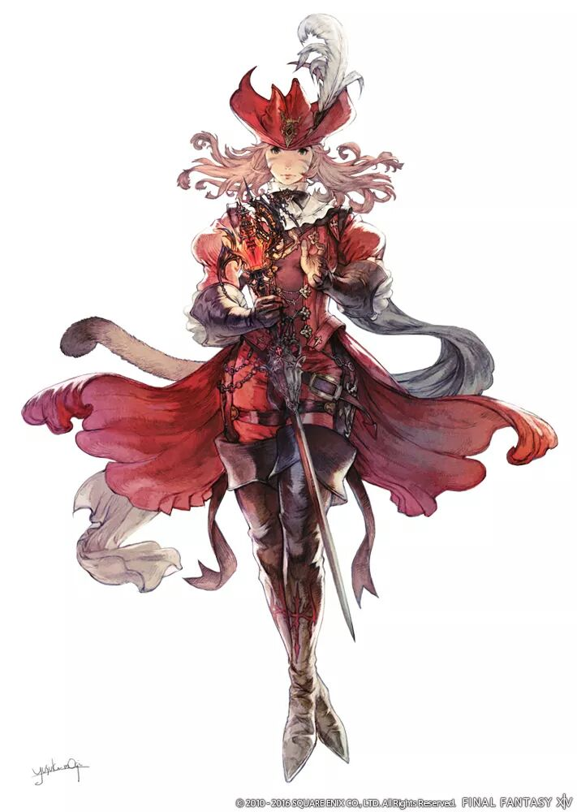

<style>
    p{color: gold};
</style>
# Titre de niveau 1
*Sous titre italique*
## Titre de niveau 2

**Texte en gras**

- code
<div>
    <article>
        <p> Bonjour</p>
    </article>
</div>

    let document.getElementById("intro");

> Citation

1. Liste ordonnée
2. Second élément

------

[Lien vers cheatSheet markdown](https://www.markdownguide.org/cheat-sheet)



`let document.getElementById("intro");`

```
Test
etra
aeta
eat
```

~~Texte barré~~